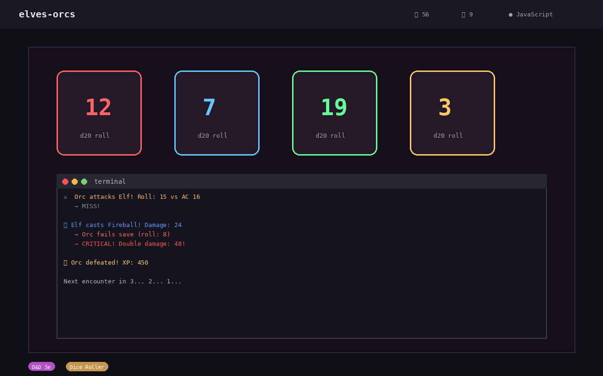

# Elves & Orcs

[](https://github.com/stennu718/elves-orcs/actions/workflows/tests.yml)
[](https://github.com/stennu718/elves-orcs/actions/workflows/docker.yml)
[](LICENSE)



## Description

Elves & Orcs is a digital remake of the Estonian social deduction game **"Kings & Spies"** (*Kuningad & Spioonid*). In this tense deduction challenge, you must identify two hidden spies among your team of characters before time runs out.

Originally a tabletop game popular in Estonia, Kings & Spies tests your ability to analyze behavior, track patterns, and make logical deductions under pressure. This digital adaptation brings the experience to life with an interactive interface and streamlined gameplay.

## Features

- **Social deduction gameplay** — Analyze mission results to uncover hidden spies
- **5-day time limit** — Race against the clock to gather enough information
- **Mission system** — Send characters on missions and observe the results
- **Note-taking tools** — Track your observations and narrow down suspects
- **AI opponent** — Play against a computer-controlled adversary
- **Responsive UI** — Clean, modern interface built with React

## How to Play

1. You have **5 in-game days** to identify **2 hidden spies** among your characters.
2. Each day, you may send **up to 3 characters** on a mission.
3. After each mission, the game log tells you **how many spies** were present on that mission.
4. Use your **observation notes** to track which characters appear suspicious.
5. On **Day 5**, you must make your final accusation — choose the 2 characters you believe are the spies.

**Correct guess = Victory. Wrong guess = The kingdom falls.**

The key is to cross-reference mission results: if a mission with 3 characters returned 0 spies, all three are safe. Use logic and deduction to narrow down the suspects!

## Quick Start

```bash
npm install
npm run dev
```

The game will be available at `http://localhost:3000`.

## Tech Stack

- **Language:** TypeScript 5+
- **Framework:** React 19
- **Build Tool:** Vite 6
- **Testing:** Vitest
- **Styling:** Tailwind CSS 4
- **CI/CD:** GitHub Actions
- **Deployment:** Docker

## Project Structure

```
elves-orcs/
├── src/
│   ├── game/
│   │   └── logic.ts       # Core game logic and rules
│   ├── App.tsx            # Main application component
│   ├── main.tsx           # Entry point
│   └── index.css          # Global styles
├── tests/                 # Unit and integration tests
├── .github/workflows/     # CI/CD pipelines
├── Dockerfile             # Container configuration
├── vite.config.ts         # Vite configuration
├── vitest.config.ts       # Vitest configuration
└── tsconfig.json          # TypeScript configuration
```

## License

This project is licensed under the MIT License — see the [LICENSE](LICENSE) file for details.
